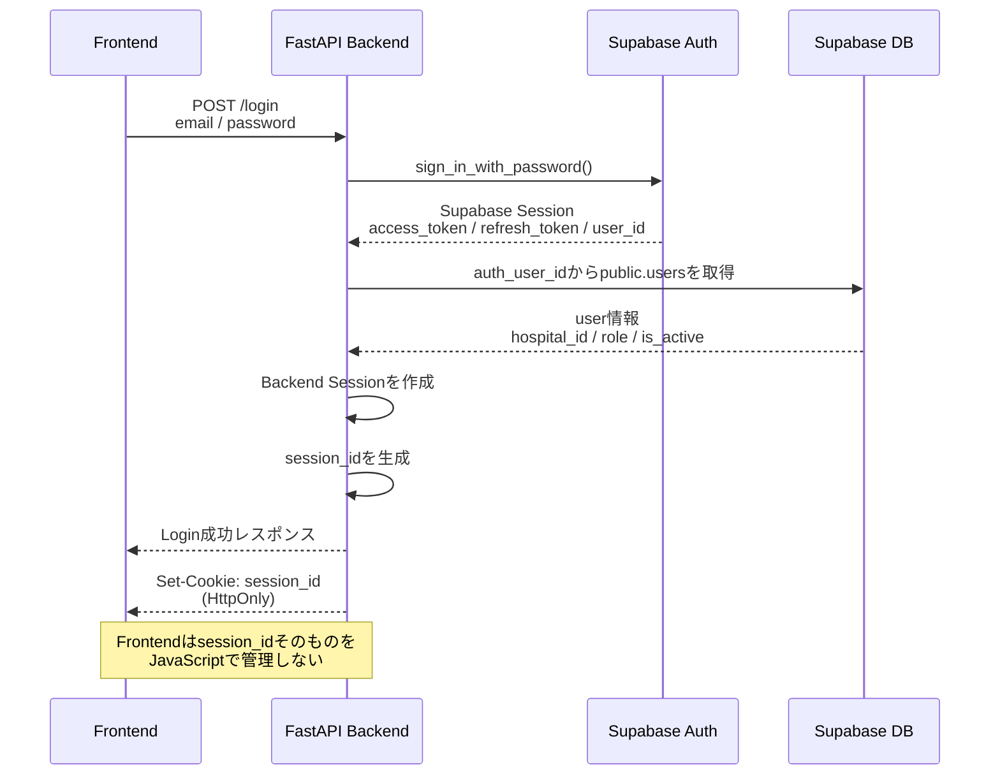
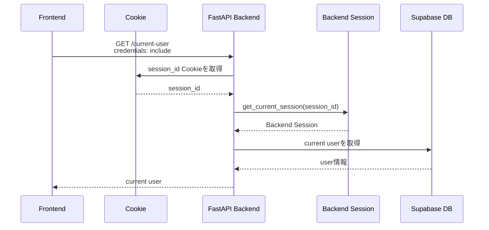
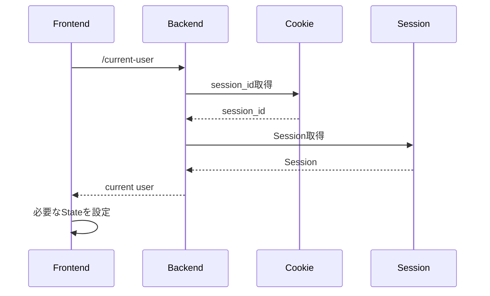
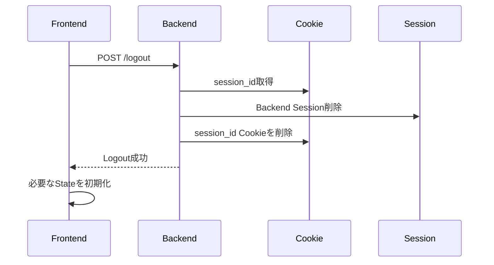
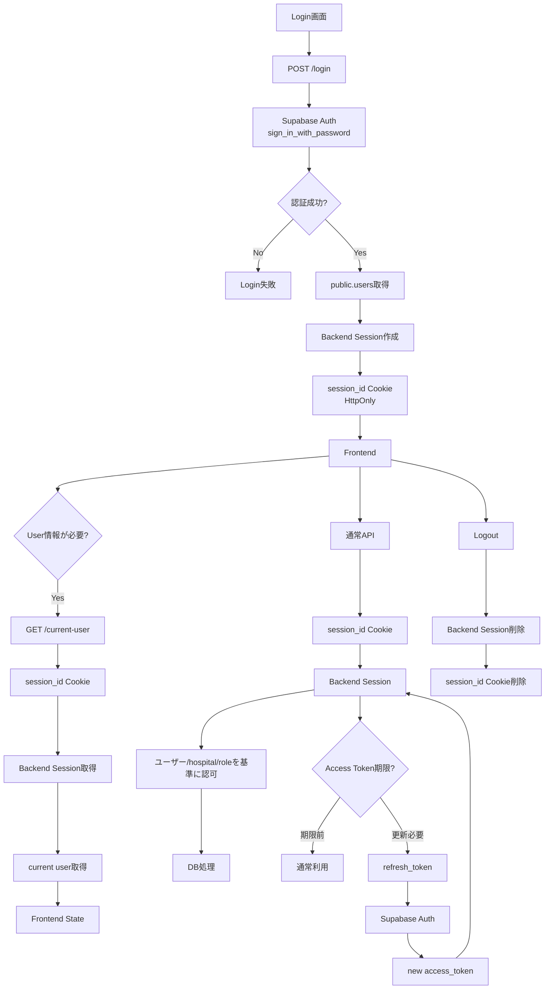

# 認証フロー（現行構成）

## 1. 現在の認証設計

現在は `AuthContext` を使用しない構成としている。

Frontendでは、認証状態を常時Contextで保持するのではなく、**必要なタイミングで `/current-user` を呼び出して現在のユーザーを取得する**。

認証の根となる情報はFrontendのユーザーStateではなく、Backendが管理する **`session_id` Cookie → Backend Session** である。

```text
Frontend
  │
  │ 必要時に /current-user
  ▼
HttpOnly Cookie
  session_id
  │
  ▼
Backend Session
  │
  ├─ access_token
  ├─ refresh_token
  └─ user情報との紐付け
       │
       ▼
Supabase Auth / public.users
```

---

# 2. Loginから認証が確立するまで



## 3. Login時の重要ポイント

### Supabase Auth

Login時にはBackendからSupabase Authへ、

```text
email
password
```

を渡して認証する。

成功するとSupabaseから、

```text
access_token
refresh_token
user_id
```

などを取得する。

Backendはこの情報を利用して `public.users` と紐付ける。

### Backend Session

Login成功後、Backend側でSessionを作成する。

概念的には、

```text
session_id
    ↓
Backend Session
    ├── access_token
    ├── refresh_token
    └── user_id 等
```

という関係になる。

Frontendには `session_id` をJavaScriptの変数やlocalStorageへ保存させず、**HttpOnly Cookie**として渡す。

---

# 4. Login後にユーザー情報が必要になった場合

現在は `AuthContext` に保存されたユーザー情報を参照するのではなく、必要な箇所で `/current-user` を呼び出す。



### `/current-user` の認証の流れ

```text
Browser
  │
  │ Cookie: session_id
  ▼
/current-user
  │
  ▼
get_current_session()
  │
  ▼
Backend Session
  │
  ├── access_token
  └── user情報
  │
  ▼
current user取得
  │
  ▼
Frontend
```

ここでFrontendが受け取る `user` 情報は、主として画面表示やUI制御に使用する。

**認証そのものの根は `session_id` → Backend Session にある。**

---

# 5. 通常のAPIを呼び出す場合

通常のAPIでは、FrontendからBackendへリクエストを送る。

```text
Frontend
   │
   │ API request
   │ credentials: include
   ▼
Backend
   │
   │ Cookie: session_id
   ▼
get_current_session()
   │
   ▼
Backend Session
   │
   ├── user_id
   ├── hospital_id
   ├── role
   └── access_token
   │
   ▼
認可・DB処理
```

重要なのは、Frontendから送られた `hospital_id` などをそのまま認証情報として信用するのではなく、**Backend Sessionに紐付いたユーザー・hospital情報を基準に処理する**ことである。

例えば、

```text
Frontend:
hospital_id = A
```

としてリクエストを送っても、Backend Sessionが

```text
hospital_id = B
```

なら、Backend側ではSessionのユーザーが所属するBを認証・認可の基準とする設計にする。

---

# 6. Token Refresh

Access Tokenには有効期限があるため、期限切れ前にRefreshを行う。

概念的な流れは、

```text
session_id Cookie
       │
       ▼
Backend Session
       │
       └── refresh_token
              │
              ▼
       Supabase Auth
              │
              ▼
        new access_token
              │
              ▼
       Backend Session更新
```

Frontendが直接refresh tokenを保持してRefreshするのではなく、Backend Sessionを基準にRefreshする。

---

# 7. Page Reload時

現在は `AuthContext` による認証状態の復元を行わない。

ページをReloadするとFrontendのReact Stateは初期化されるため、必要な場所で `/current-user` を呼び出して現在のユーザーを取得する。



つまりReloadしても、

```text
React State
    ↓
消える

HttpOnly Cookie
    ↓
残る

session_id
    ↓
Backend Session
    ↓
current user
    ↓
Frontend Stateを再構築
```

という流れになる。

---

# 8. Realtimeとの関係

RealtimeでSupabaseを利用する場合は、Supabase Realtimeが必要とするaccess tokenを利用する。

概念的には、

```text
Backend Session
      │
      └── access_token
              │
              ▼
Frontend
      │
      ▼
Supabase Realtime
```

となる。

Realtimeの認証に使用するaccess tokenと、Backend APIの認証根である`session_id`は役割が異なる。

```text
session_id
  ↓
Backend APIの認証根

access_token
  ↓
Supabase / Realtimeとの認証に利用
```

---

# 9. Logout

LogoutではBackend側のSessionを破棄し、Cookieを削除する。



Logout後は、

```text
session_id Cookie
      ↓
無効
      ↓
Backend Session取得不可
      ↓
認証されたAPIアクセス不可
```

となる。

---

# 10. 認証フロー全体



---

# 11. 現行構成のポイント

| 項目 | 現在の構成 |
|---|---|
| Frontend AuthContext | **廃止** |
| Frontendでの認証状態保持 | 必要時に取得 |
| User取得 | `/current-user` |
| 認証の中心 | `session_id` Cookie |
| Cookie | HttpOnly |
| Backend Session | 認証情報を保持 |
| Access Token | Supabase API / Realtime等に利用 |
| Refresh Token | Backend Session側で管理 |
| hospital_id | Backend Session側のユーザー情報を基準 |
| Logout | Backend Session破棄 + Cookie削除 |
| Reload | `/current-user`でユーザー情報を再取得 |

---

# 12. 設計上の基本原則

現在の認証設計では、

> **FrontendのUser Stateを認証の根拠にしない**

ことが重要である。

Frontendで取得した、

```text
user
hospital_id
role
```

などはUI表示・画面制御に利用できるが、セキュリティ上の最終判断はBackendで行う。

Backendでは、

```text
session_id Cookie
       ↓
Backend Session
       ↓
認証済みuser
       ↓
hospital_id / role
       ↓
認可
       ↓
DB処理
```

という順序で処理する。

これにより、FrontendのDevToolsからリクエスト内容を書き換えられても、Backend Sessionを基準とした認証・認可を維持できる。
